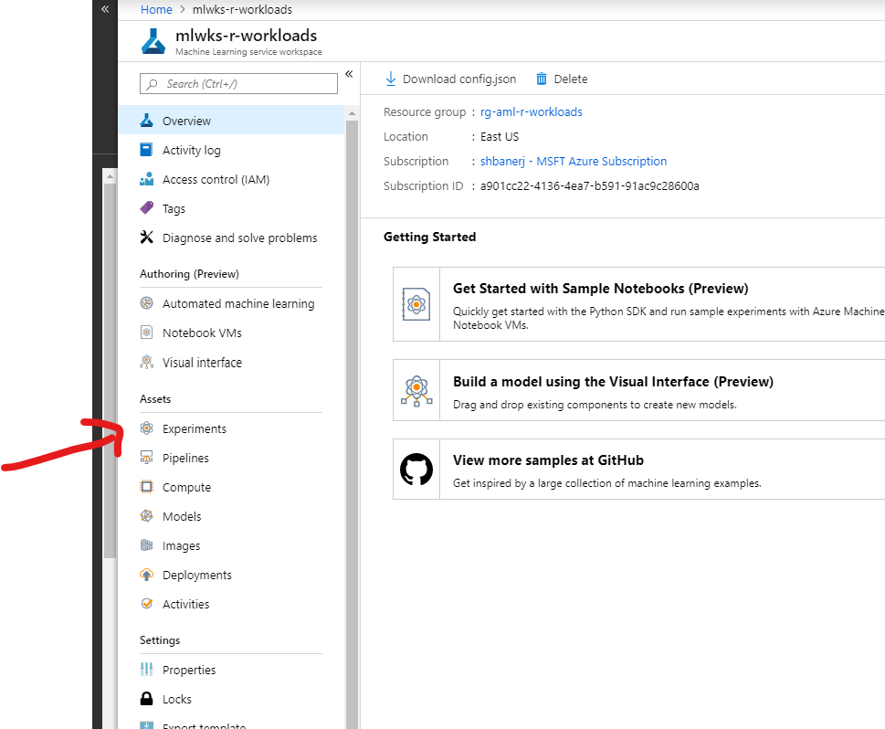
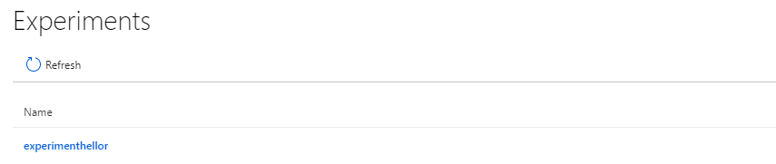
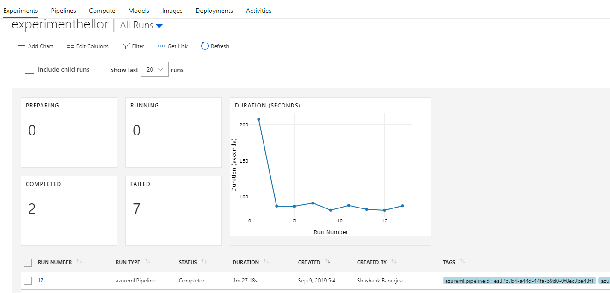
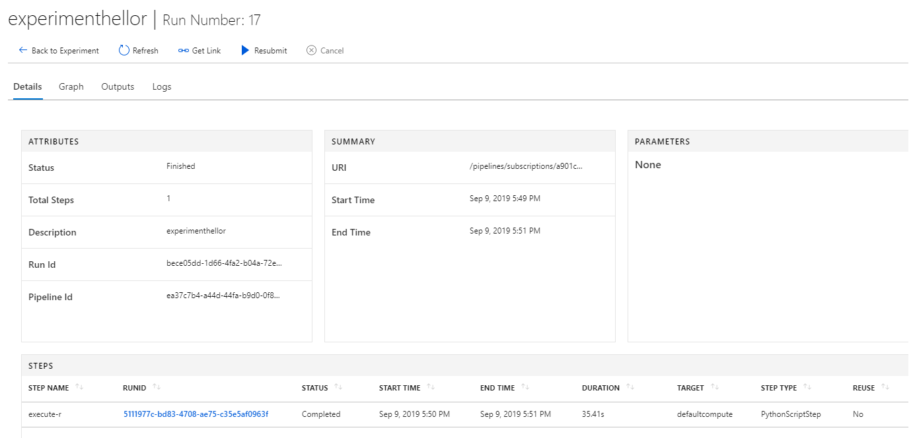
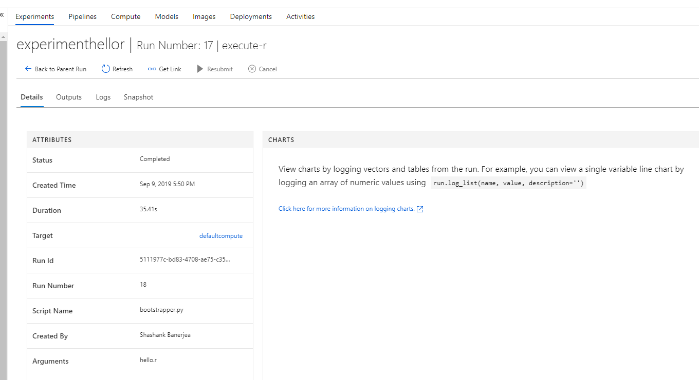
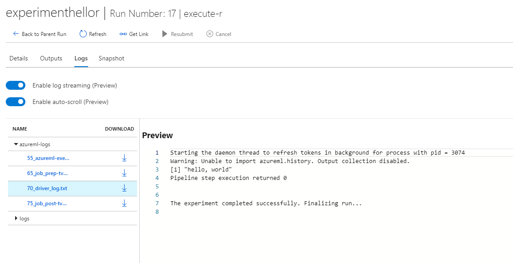

# Bringing R Workloads to Azure Machine Learning Service

## Credits

This solution was designed by Josh Lane (@jplane). Special shout to Josh for reviewing the contents of the repository and technical guidance.

## Making the case

The two of the most popular platforms for data science workloads are – R and Python. Both platforms have a large ecosystem of libraries and support which enable developers and innovators to build solutions quickly and efficiently. Looking more closely however, it is quite evident that around the academic and research, R draws at least as many supporters as Python.

Azure Machine Learning (AML) Service is a hosted service which empowers organizations to streamline the building, training and deployment of machine learning models at scale.

Azure Machine Learning currently provides direct support for Python and popular ML frameworks like ONNX, PyTorch, scikit-learn, and TensorFlow. With its Studio interface and Juypter notebooks there are additional capabilities available through a Python SDK.

This article demonstrates the use of the AML Python SDK to run R Workloads in Azure Machine Learning pipelines.

This article assumes that reader has basic knowledge of the R and Python languages, familiarity with Azure Machine Learning Service, and with use of the Azure Portal. It also requires basic understanding of Docker and container registries.

## Broadly Speaking

The approach to run R workloads on Azure is enabled by AML’s ability to run workloads in purpose-built Docker containers across different choices of compute.

The first step is to build a Docker container that can support R workloads. This container packages the R runtime and essential libraries required to execute the R workload.

The container is built and published to a container repository; in this example we’ll use Azure Container Registry.

The next step adds execution of Docker container to an Estimator step, which becomes part of an AML pipeline. Prior to execution, the R script will be uploaded to the AML workspace and configured as a parameter to the AML step bootstrap routine written in Python. Finally, this new AML pipeline is published to the AML Service for execution.

When the pipeline is invoked it will download the docker container, obtain the R script from workspace storage and execute it.

## Configuring the Azure Machine Learning Service Workspace

### Azure ML Workspace

To be able to execute R script described in this article, the Azure Machine Learning Services (AMLS) Workspace should be configured as follows:

- Workspace provisioned and available.
- A choice of compute successfully provisioned. This article uses the compute option of Machine Learning Compute

### Creating Service Principal

The article uses the Python SDK to execute code against the AML workspace, to execute the code successfully, it also requires:

- An Azure AD Service Principal created with a secret.
- The service principal given access to the Azure Machine Learning Workspace as a “Contributor”.

## The R Docker Container

### Creating the container locally

Since we are using a Python script to bootstrap the execution of R workload, the docker container needs to support both R and Python. One popular base image for this purpose is  continuumio/miniconda3:4.6.14

The Dockerfile we are using for this article is as follows:

``` Dockerfile
FROM continuumio/miniconda3:4.6.14

WORKDIR /app

RUN apt-get update && yes Y | apt-get install build-essential

RUN conda install -c r r-essentials
```

To create a docker image, run the following command in the same path as the docker definition, stored as Dockerfile.

``` bash
docker build -t aml-r .
```

### Pulling in Additional R libraries

There may be scenarios, were additional R libraries may be required for execution of the intended workload. To enable that, the Docker image used for execution of the workload can be extended by adding line such as these to the Dockerfile.

``` Dockerfile
RUN R --vanilla -e 'install.packages(c( "RPostgreSQL", \
                                        "DBI",         \
                                        "lubridate",   \
                                        "RSQLite",     \
                                        "magrittr",    \
                                        "zoo",         \
                                        "functional",  \
                                        "moments",     \
                                        "fpc",         \
                                        "RcppRoll",    \
                                        "cowplot",     \
                                        "tsne",        \
                                        "config",      \
                                        "factoextra",  \
                                        "NMF",         \
                                        "ggcorrplot",  \
                                        "umap"), repos="http://cran.r-project.org")'

```

The above shows the docker image being built with additional R libraries to support – PostgreSQL, SQLite and more advanced capabilities.

### Publish the Docker Container to ACR

The instructions to publish a docker container image to Azure Container Registry (ACR) are provided on this [link](https://docs.microsoft.com/en-us/azure/container-registry/container-registry-get-started-docker-cli)

After authenticating with the Azure Container Registry, based on the instructions provided, run the following commands (assuming myregistry is the name of the ACR created):

``` bash
docker tag aml-r myregistry.azurecr.io/aml-r
```

This will create an alias for the image in the local repository. Next, push the image to registry with the following command:

``` bash
docker push myregistry.azurecr.io/aml-r
```

## Configuring the AML Pipeline Bootstrapper

To execute the R script, we use a initializer script written in Python. This python script (called bootstrapper.py) creates a bash shell and launches the RScript executable with the provided R script name.

Source code for the bootstrapper.py is as follows:

``` python
import os
import sys
import subprocess
import uuid


def boot(*args):
  try:
    ret = subprocess.run(args)

    if ret.returncode < 0:
        print("Pipeline step execution was terminated by signal",
             -(ret.returncode),
              file=sys.stderr)
    else:
        print("Pipeline step execution returned",
            ret.returncode,
            file=sys.stderr)

    except OSError as e:
        print("Execution failed:", e, file=sys.stderr)
        return 1

    return ret.returncode

if __name__ == "__main__":
    entry_script = sys.argv[1]
    sys.exit(boot('Rscript', '--no-site-file', '--no-environ', '--no-restore', entry_script))

```

## Running the R code in the AML Pipeline

To enable running of the arbitrary workload in Azure Machine Learning Pipeline, the Python SDK provides us with two constructs – Estimator and EstimatorStep classes.

The Estimator class is designed for use with machine learning frameworks that do not already have an Azure Machine Learning pre-configured estimator. It wraps run configuration information to help simplify the tasks of specifying how a script is executed.

The EstimatorStep class executes the estimator as part of an Azure ML Pipeline.

The code to create an Estimator and EstimatorStep with the bootstrapper.py initializer file and _hello.r_ R script in the custom Docker image is shown as follows:

``` python
r_script='hello.r'

aml_experiment_name='experimenthellor'
aml_compute_target='defaultcompute'
acr_details = ContainerRegistry()
acr_details.address = 'mydockerimageregistry.azurecr.io'
acr_details.username = 'mydockerimageregistry'
acr_details.password = 'mysupersecretacrpassword!'
acr_image = 'aml-r'

estimator = Estimator(source_directory='src',
                          entry_script='bootstrapper.py',
                          compute_target=aml_compute_target,
                          custom_docker_image=acr_image,
                          image_registry_details=acr_details,
                          user_managed=True)

bootstrap_args = [r_script]
inputs = []

step = EstimatorStep(
        name='execute-r',
        estimator=estimator,
        estimator_entry_script_arguments=bootstrap_args,
        inputs=inputs,
        outputs=None,
        compute_target=aml_compute_target,
        allow_reuse=False)
```

For this article, the initializer and R Scripts are placed in a sub-folder called src.

## Putting it all together

Once, the estimator step is created, create an AML Pipeline and run it as part of the experiment. That is accomplished by the following code:

``` python
aml_pipeline = AmlPipeline(
                 workspace=aml_workspace,
                 steps=AmlStepSequence([step]),
                 description='Run R Workloads')

aml_run = published_pipeline.submit(workspace=aml_workspace,
                                       experiment_name=aml_experiment_name)
print(aml_run)
```

## Tracking Execution of the R Workloads

The execution of the pipeline can be viewed from the Azure Portal, as part of an AML Experiment. To do this, log on to Azure Portal and navigate to AML Workspace. Click on the “Experiments” option in the left panel.



Select the experiment created for this workload. In this article, we are using “experimenthellor”.



Click on the experiment name to get the list of runs for the experiment.



Click on the latest successful run to get the list of steps in the pipeline run. During the first execution of the pipeline, the compute may require time to spin up, so the pipeline run status may show as – “NotStarted”.



Click on the pipeline step – “execute-r”, to show the obtain the details of the step.



Click on “Logs” tab to view the details of the execution of the “R” script



In the logs, you can see the output of the hello.r script is available as “[1] hello, world”. If there were errors, they would show up in the logs for troubleshooting.

## Conclusion

In addition to supporting Python workload, Azure Machine Learning Service is flexible to support execution of R workloads as well. That is just one more reason to try out Azure Machine Learning Service for your next data science project. While this repository has a simple implementation intended for a quick rollout, more advanced implementations are possible with mounted volumes.

## References

[Azure Machine Learning Service](https://azure.microsoft.com/en-us/services/machine-learning-service/)
[AML Python SDK](https://docs.microsoft.com/en-us/python/api/overview/azure/ml/intro?view=azure-ml-py)
